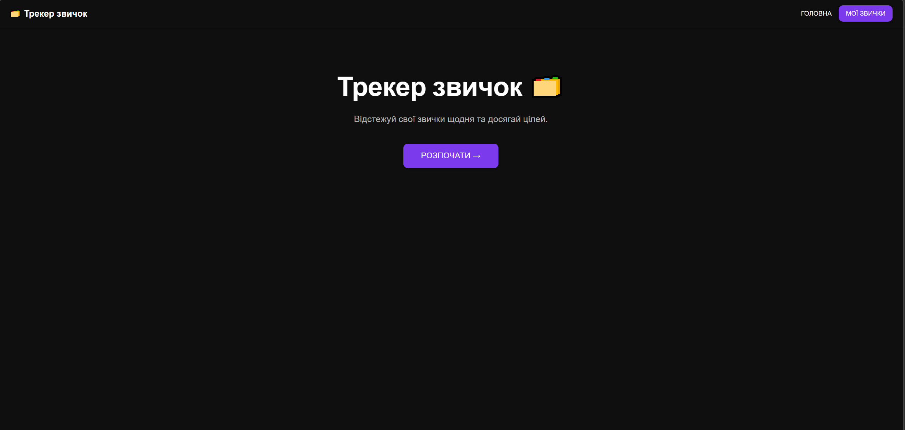
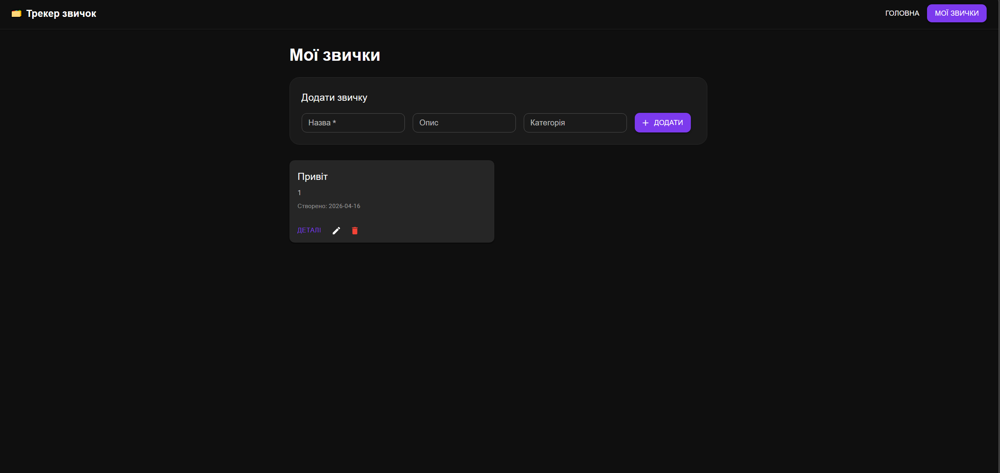
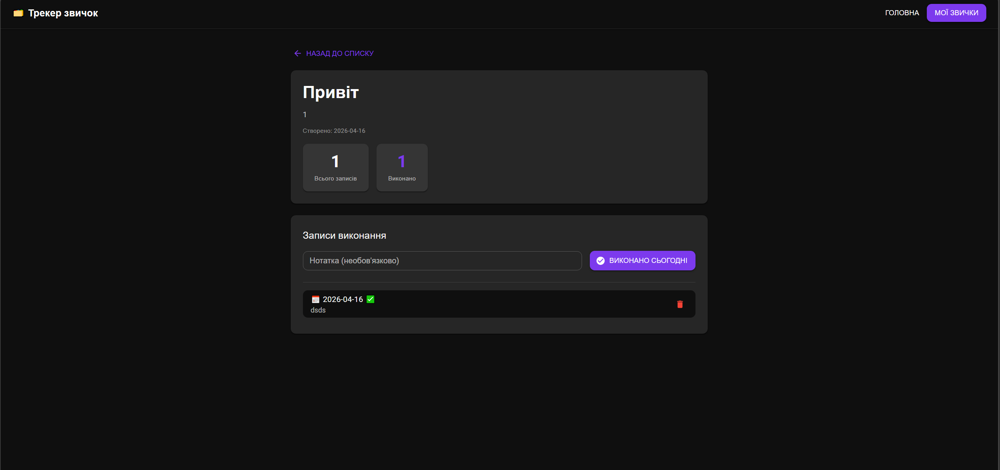

# Habit Tracker

Веб-застосунок для відстеження особистих звичок. Дозволяє створювати звички, редагувати їх та відмічати щоденне виконання.

## Технологічний стек

- **Backend:** Node.js, Nest.js, TypeScript
- **Frontend:** React + Vite + TypeScript
- **Зберігання даних:** In-memory
- **Контроль версій:** Git + GitHub

## Сутності

**Habit (Звичка)**
- `id` унікальний ідентифікатор
- `name` назва
- `description` опис
- `category` категорія
- `createdAt` дата створення

**HabitLog (Запис виконання)**
- `id` унікальний ідентифікатор
- `habitId` посилання на звичку
- `date` дата (YYYY-MM-DD)
- `completed` чи виконано
- `note` нотатка

## Запуск

### Backend

```bash
cd backend
npm install
npm run start:dev
```

Сервер запускається на http://localhost:3000

### Frontend

## Скріншоти

### Головна сторінка


### Список звичок


### Деталі звички


```bash
cd frontend
npm install
npm run dev
```
